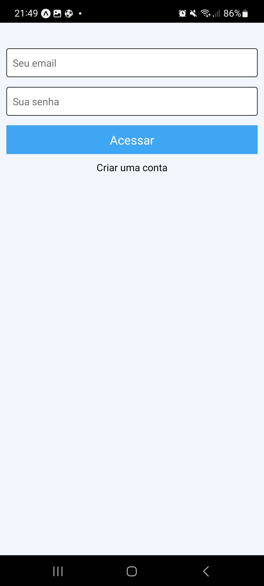

# To do list - React Native with Firebase

# Technologies used:
* React Native: Hooks(useState, useEffect, useRef), Components, StyleSheets.
* Firebase: Users Authentication with email and password, NoSQL Database. 

## Resume
application developed for academic purposes, a to-do list was made to implement the Firesase platform user and database systems. In this application it is possible to create a user with email and password, and access your to-do list, with the functionalities of creating, editing and deleting tasks.

## Login screen:

 

## Tasks screen:

 

## Task Screen:

## Edit Task Screen:

 

## Users in Firebase:

 

## Database in Firebaase

